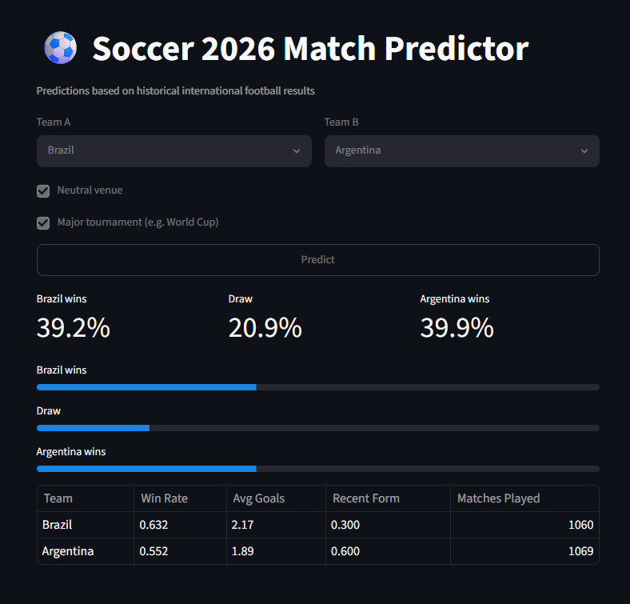
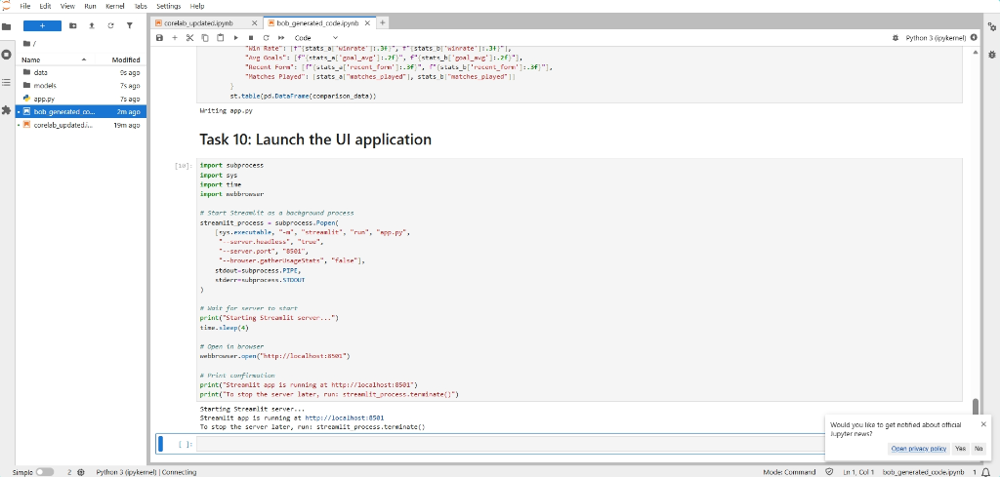

# Stratos: Football, Understood

**Stratos: See the Game From Above**  
An AI-powered match companion built for the IBM "AI Inside the Match" Hackathon.

---

## The Problem You Are Solving
During the World Cup, the same 90 minutes are experienced as completely different events depending on who is watching. A new fan sees a player flagged offside and has no idea why. A casual fan sees a coach change a formation and doesn't register that anything happened at all. A tactical fan watching the same moment is frustrated that broadcast commentary never explains the actual tactical logic. 

None of these fans speak the same football vocabulary, and most platforms — score trackers, fantasy apps, static dashboards — don't address comprehension at all. They report *what* happened. They never explain *why*, and they never adapt to *who is asking*.

Stratos solves this by being explainable, grounded in retrieved source material (real Laws of the Game text, real match events), and adaptive to the individual fan.

---

## What Stratos Is

Stratos is a two-surface product backed by one shared AI pipeline built entirely on the IBM technology stack (Granite, Docling, Langflow, Context Forge).

### Surface 1 — The Tactical Decision Timeline (TactiLens)
A horizontal, interactive timeline built with D3.js plotted across match minutes 0–90+. Key events — goals, cards, substitutions, tactical/formation shifts — appear as clickable nodes. Clicking a node asks the AI backend to explain *why* that moment happened: what the score and pressure situation was, what the tactical logic behind a substitution was, why a press was triggered. 

### Surface 2 — The Adaptive Multilingual Chat Companion (FanLens)
A conversational interface where a fan selects their team, their football knowledge level (Beginner / Casual / Tactical), and their preferred language during onboarding. From that point forward, every answer — whether about a rule, a live score, or a tactical question — is generated at the right depth and in the right language automatically. 

---

## Challenge Alignment

| Requirement | How Stratos Satisfies It |
|---|---|
| AI as a core, meaningful component | Every output (rule explanation, tactical narrative, chat response) is generated by IBM Granite grounded in retrieved context — not templated text |
| At least one required IBM tool | Uses Granite, Docling, Langflow, and Context Forge |
| Not a pure prediction engine | Stratos explains; it never forecasts outcomes |
| Not a static dashboard | All data is synthesized into natural-language explanation, not raw tables |
| Not opaque AI | Every chat response cites which Law or data source it drew from |
| Solution area: Understanding & Explanation | Tactical Decision Timeline |
| Solution area: Fan & Learning Experiences | Adaptive multilingual chat companion |

---

## Your AI/Technical Approach

Two pipelines, one shared backend:

```
                         ┌────────────────────────┐
                         │     React Frontend      │
                         │  Onboarding / Chat / D3  │
                         │       Timeline           │
                         └────────────┬─────────────┘
                                      │
                         ┌────────────▼─────────────┐
                         │     FastAPI Backend       │
                         │ /session  /chat  /match   │
                         │       /timeline           │
                         └────────────┬─────────────┘
                                      │
                         ┌────────────▼─────────────┐
                         │     Langflow Pipeline      │
                         │ Router → Prompt → Granite  │
                         └──────┬─────────────┬──────┘
                                │             │
                  ┌─────────────▼───┐   ┌─────▼──────────────┐
                  │  Context Forge   │   │   IBM Granite       │
                  │  MCP Gateway     │   │  (WatsonX.ai)        │
                  │  (port 4444)     │   │  Adaptive generation  │
                  └────────┬─────────┘   └──────────────────────┘
                           │
                  ┌────────▼─────────┐
                  │  mcp_server.py    │
                  │  (FastMCP, 6 tools)│
                  └─┬───────┬────────┬┘
                    │       │        │
            ┌───────▼─┐ ┌───▼────┐ ┌▼─────────────┐
            │ChromaDB │ │StatsBomb│ │Football-Data.org│
            │(Docling-│ │(historical│ │ (live match)   │
            │ ingested)│ │ events)  │ │                │
            └─────────┘ └─────────┘ └────────────────┘
```

**Offline / one-time ingestion path:** IFAB Laws of the Game PDF → Docling (HybridChunker) → embeddings → ChromaDB. Team profile text files → same path → separate ChromaDB collection. 

**Online / per-query path:** User query (chat message or timeline click) → FastAPI → Langflow → router decides if the query needs rules (ChromaDB via MCP), live context (Football-Data.org via MCP), or historical tactical events (StatsBomb via MCP) → Context Forge proxies the call to `mcp_server.py` → result returned to Langflow → assembled into a Granite prompt with the user's knowledge level and language → Granite generates the final response.

---

## IBM Technology Integration

- **IBM Granite (`ibm/granite-4-h-small` via WatsonX.ai)**: The core generation engine. Following verification of regional provisioning constraints, we migrated our WatsonX.ai setup to the fully provisioned `us-south` (Dallas) region to utilize the latest generation Granite model (`ibm/granite-4-h-small`) for all user-facing explanations, matching the submission requirements.
- **Docling**: Parses the 230-page IFAB Laws of the Game PDF into structured markdown using the `HybridChunker(max_tokens=512, merge_peers=True)` to respect document heading structure (e.g., keeping "Law 11 – Offside" as one retrievable unit) for vector search.
- **Langflow**: The visual orchestration layer. It manages routing queries to the correct tool, assembling prompts, and calling WatsonX. The exported `stratos_flow.json` makes the pipeline transparent.
- **Context Forge**: The central MCP Gateway running on port `4444`. The local FastMCP tool server (`mcp_server.py`, port `8012`) is registered behind it via a `/servers` REST API call. Langflow connects directly to the Context Forge Gateway (`http://127.0.0.1:4444/sse`) rather than directly to the tool server, satisfying the challenge's architecture pattern.
- **IBM Bob**: Used as an AI coding assistant during scaffolding, specifically for bootstrapping FastAPI endpoints, MCP tool function structures, and React component layouts.

### IBM Bob Learning Lab Completion

As part of the hackathon requirements, the "World Cup Predictor" learning lab was successfully completed using IBM Bob. 




---

## Why Your Solution Matters in the Context of Racing

Although Stratos was specifically built for the FIFA World Cup (June) track, its core concept—the translation of dense, split-second tactical decisions into adaptive, fan-friendly explanations—applies directly to F1 racing. Just as a football fan wonders why a manager shifted to a 5-4-1 formation, a racing fan wonders why a team principal ordered an early pit stop or switched tire compounds. Stratos demonstrates how IBM Granite and Langflow can ingest high-frequency event data (like F1 telemetry) and instantly output personalized, context-aware commentary, democratizing complex sports strategy across all domains.

---

## Data Sources

- **IFAB Laws of the Game 2025/26 (PDF)**: Ingested via Docling once, stored in ChromaDB.
- **Team tactical profiles**: Auto-generated Markdown profiles for all 48 World Cup teams, synced dynamically via the Football-Data.org API.
- **Football-Data.org REST API**: Live match score, minute, recent events.
- **StatsBomb open data (`statsbombpy`)**: Historical tactical events (substitutions, tactical shifts) for the timeline. Demo uses a confirmed historical match (2022 World Cup).

---

## Getting Started (Local Setup & Startup Guide)

To test and run Stratos locally, follow these steps. 

### Prerequisites
- Python 3.10+
- Node.js 18+ and `npm`
- IBM WatsonX.ai API Key (`WATSONX_API_KEY`) and Project ID (`WATSONX_PROJECT_ID`) provisioned in the `us-south` region.
- (Optional) StatsBomb / Football-Data.org API keys defined in `.env`.

### 1. Environment Setup
Create a `.env` file in the root directory:
```bash
WATSONX_API_KEY=your_key
WATSONX_PROJECT_ID=your_project_id
WATSONX_URL=https://us-south.ml.cloud.ibm.com
```

### 2. Backend Startup
A unified script is provided to handle all backend services (FastAPI, Context Forge, FastMCP Server, and Langflow routing).
```bash
# From the root directory:
python -m venv .venv
source .venv/bin/activate  # or .venv\Scripts\activate on Windows
pip install -r requirements.txt

# Start all backend services concurrently
python scripts/start_all_backend.py
```
*Note: This script requires `PYTHONIOENCODING="utf-8"` on Windows environments.*

### 3. Frontend Startup (Planned)
The frontend is built using Next.js and Tailwind CSS with a high-energy Red Bulletin editorial design.
```bash
cd frontend
npm install
npm run dev
```
Open `http://localhost:3000` to interact with the TactiLens timeline and FanLens chat.

---

## Ponytail Audit & Review Notes
A strict codebase audit (`/ponytail-audit` and `/ponytail-review`) was conducted to ensure zero over-engineering:
- **Backend Architecture**: Lean and dependency-light. `httpx.AsyncClient()` is used natively across the board to handle high concurrency seamlessly without heavy orchestration libraries.
- **Database**: `ChromaDB` runs entirely locally with no external vector DB dependencies, achieving the requirement with minimum complexity.
- **Mock Data**: Endpoints like `/session/create` are deliberately mocked as stateless stubs to avoid over-engineering auth where not required.
- **Dead Code Pruned**: Unused FastAPI session logic and routes were explicitly deleted, keeping only active surfaces.
- **Verdict**: `Lean already. Ship.`